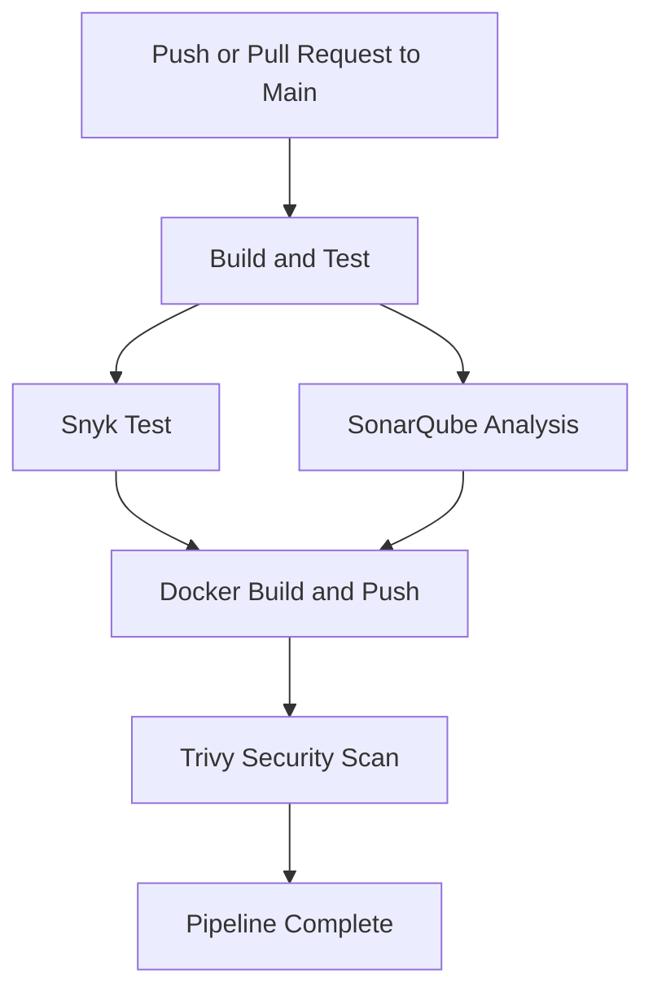

## **CI/CD Pipeline Documentation**

### **Jobs Breakdown**

#### **1. Build and Test**
- **Purpose**: Builds the application, validates secrets, installs dependencies, and runs unit tests with code coverage collection.
  
**Key Steps**:
1. **Check out the code**: Clones the repository to the runner.
2. **Set up Go (v1.22)**: Prepares the Go environment for building and testing.
3. **Cache Go modules**: Speeds up builds by caching dependencies.
4. **Validate Secrets**: Ensures required secrets (`MONGODB_URI`, `JWT_SECRET`, `DB_NAME`) are properly configured.
5. **Install dependencies**: Runs `go mod tidy` to fetch project dependencies.
6. **Run unit tests**: Executes `go test` with code coverage and outputs `coverage.out`.

---

#### **2. Snyk Test**
- **Purpose**: Scans the application dependencies for vulnerabilities using Snyk.
  
**Key Steps**:
1. **Check out the code**: Clones the repository.
2. **Set up Go**: Prepares the Go environment.
3. **Run Snyk Monitor**: Scans the project dependencies for known vulnerabilities.
4. **Optional**: Allows the pipeline to continue even if vulnerabilities are found (`continue-on-error: true`).

---

#### **3. SonarQube Analysis**
- **Purpose**: Analyzes code quality, test coverage, and detects security vulnerabilities using SonarQube.
  
**Key Steps**:
1. **Check out the code**: Clones the repository to the runner.
2. **Download test coverage**: Uses `coverage.out` generated in the `build-and-test` step.
3. **Run SonarQube Scan**: Executes the SonarQube scanner using `sonarsource/sonarqube-scan-action` with required tokens and project configuration.

---

#### **4. Docker Build and Push**
- **Purpose**: Builds a Docker image for the application and pushes it to Docker Hub.

**Key Steps**:
1. **Check out the code**: Clones the repository.
2. **Set up Docker Buildx**: Prepares a Buildx builder for efficient Docker image builds.
3. **Login to Docker Hub**: Authenticates to Docker Hub using credentials stored in GitHub secrets.
4. **Build Docker image**: Uses the `docker/build-push-action` to build the image.
5. **Push Docker image**: Pushes the image to Docker Hub with the `latest` tag.

---

#### **5. Container Security Scanning with Trivy**
- **Purpose**: Scans the Docker image for critical and high-severity vulnerabilities using Trivy.

**Key Steps**:
1. **Run Trivy**: Executes the `aquasec/trivy` tool to analyze the built Docker image.
2. **Enforce Security Checks**: Fails the pipeline if critical vulnerabilities are found.

---

### **Pipeline Workflow Overview**

---

### **Environment Variables and Secrets**

| **Secret Name**        | **Purpose**                                      |
|------------------------|-------------------------------------------------|
| `MONGODB_URI`          | MongoDB connection string for the application. |
| `JWT_SECRET`           | Secret key used for JWT authentication.        |
| `DB_NAME`              | Name of the MongoDB database.                  |
| `SONAR_PROJECT_KEY`    | Project key for SonarQube analysis.            |
| `SONAR_ORGANIZATION`   | Organization key for SonarQube.                |
| `SONAR_TOKEN`          | Token for authenticating with SonarQube.       |
| `DOCKERHUB_USERNAME`   | Docker Hub username for image push.            |
| `DOCKERHUB_TOKEN`      | Docker Hub access token for authentication.    |
| `SNYK_TOKEN`           | API token for Snyk vulnerability scans.        |

---

### **Key Notes**
- **Paths Ignored**:
  - Changes in the `documentation/**` directory do not trigger the pipeline.
- **Error Handling**:
  - The pipeline enforces strict security checks with Trivy and SonarQube. Critical vulnerabilities or issues will stop the pipeline.
- **Artifacts**:
  - Test coverage reports (`coverage.out`) are uploaded as part of the SonarQube analysis.

---

### **Expected Outputs**
1. **Docker Image**:
   - Built image pushed to Docker Hub under the repository: `DOCKERHUB_USERNAME/gl5-mini-project-devops:latest`.

2. **Pipeline Logs**:
   - Logs for each job (e.g., build, test, scan) accessible in the CI/CD tool.

3. **SonarQube Report**:
   - Accessible in the configured SonarQube dashboard.

4. **Trivy Report**:
   - Security vulnerabilities detected in the Docker image during the Trivy scan.
